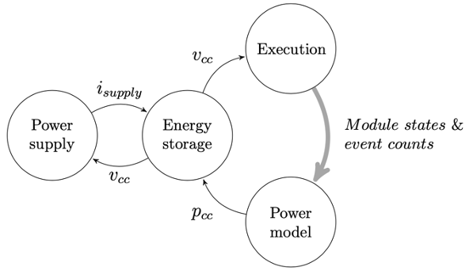
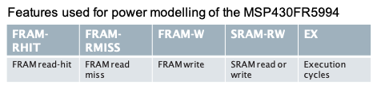

## Off and On Again
Optimising Intermittent Computing Systems
<br>
<br>
<small>Architecture Reading Group, Wednesday $28^{th}$ October 2020 </small>
<br>
<small>
Sivert Sliper
<br>
Sivert.Sliper@arm.com
</small>

---

## Outline

  + Introduction to intermittent computing
    + Motivation
    + Basic mechanics
    + Challenges & amenable applications
  + Fused introduction
    + Closed-loop energy & execution
    + Event- & state-based power model
    + Case study on intermittent computing
  + Fused in practice
    + Repository, usage & demos
  + Future work
    + Memory-system support for intermittent computing

<small>\*Slides are fairly detailed & could function as a reference.</small>

Note:
Please interrupt me if you have any questions.
I've prepared a few small demos, but I don't know how far we'll get.

---

## Internet of Things

  + A Trillion connected devices
    + Logistics, industrial automation, waste mgmgt, smart cities, medical, wearables ...
    + Extreme cost & size constraints
  + Battery-free
    + Harvest ambient energy
    + Lower cost, maintenance free, lower environmental impact
    + => Scalable

<small>[”How to Build and Connect a Trillion Things”, Rob Aitken, Arm TechCon 2017] </small>

---

  

---

# Intermittent Computing

  + Motivation
  + Basic mechanics
  + Challenges & limitations
  + Applications

--

#### Intermittent Computing:

## Basic mechanics

<div id="left">

  + Retain progress through power cycles
  + Suspend volatile state when power fails
  + Restore when power returns
  + Long-running computations progress incrementally

</div><div id="right">


</div>

--

#### Intermittent Computing:

## Basic mechanics

<div class="r-stack">

<span class="fragment fade-in" data-fragment-index="0">

</span>

<span class="fragment fade-in" data-fragment-index="1">

</span>

<span class="fragment fade-in" data-fragment-index="2">

</span>

<span class="fragment fade-in" data-fragment-index="3">

</span>

<span class="fragment fade-in" data-fragment-index="4">

</span>

</div>

--

#### Intermittent Computing:

## Challenges & Limitations


Note:
No sense of absolute time.
Can have implications for time-series data.
Difficult to do communication between two intermittent nodes.
Random power outages means you might miss events and deadlines.

The

--

#### Intermittent Computing Applications

## Predictive maintenance

<div id="left">

  + Fault/wear-out detection on machinery (bearings etc.)
  + Harvest vibrational/thermal energy
  + Monitor & analyze machine vibrations
  + Report interesting results to edge server for further analysis or decision-making

</div><div id="right">


</div>

--

#### Intermittent Computing Applications

## Bicycle sensor

<div id="left">

  + Trip counter & pressure sensor
  + Harvests mechanical energy
  + Send rotations & pressure to handle-bar mounted bicycle computer

</div><div id="right">


</div>

<small>[Bing, Balsamo, and Merrett, "An Energy-Driven Wireless Bicycle Trip Counter with Zero Energy Storage".] </small>

--

#### Intermittent Computing Applications

## Step counter

<div id="left">

  + Energy-harvesting ferroelectret insole
  + Counts steps & transmits to other wearable / phone

</div><div id="right">


</div>

<small>[Rodriguez et al., "Intermittently-Powered Energy Harvesting Step Counter for Fitness Tracking".] </small>

---

# Fused introduction

  + Motivation
  + Closed-loop energy and execution
  + Event & state-based power model
  + Case-study on intermittent computing

<small>["Fused: Closed-Loop Performance and Energy Simulation of Embedded Systems", ISPASS'20.] </small>

--

#### Fused: Full-System Simulation of Energy-Driven Computers

## Motivation

<div id="left">

  + Developing energy-driven computing systems is challenging
    + Operation driven directly by availability of energy
    + Introspection & debug affects energy conditions (and therefore execution)
    + Conventional embedded systems tools can't cope with a DUT that frequently
      powers off
    + Repeatability & reproducibility of EH power sources is problematic

</div><div id="right">

<figure>

<figcaption>A trace from intermittent execution</figcaption>

</figure>

</div>

--

##### Fused: Full-System Simulation of Energy-Driven Computers

## Overview

  


  + SystemC-based tool for simulating energy-driven computers
  + Energy & execution simulated in a closed feedback loop
  + High-level event- & state-based power model

--

##### Fused: Full-System Simulation of Energy-Driven Computers

## Simulation target

  <figure>
  
  
  <figcaption>Left: MSP430FR5994 Launchpad; Right: MSP430FR5994 MCU block diagram </figcaption>
  </figure>

Note:
For the Fused paper, we used an MSP430FR platform as our simulation target,
because of it's embedded FRAM. FRAM is an energy-efficient byte-addressable
nonvolatile memory that enables us to do checkpointing efficiently.

--

##### Fused: Full-System Simulation of Energy-Driven Computers

## Simulation target

  

Note:
To enable intermittent computing using this microcontroller, I made a test board
that looks a bit like this.

--

##### Fused: Full-System Simulation of Energy-Driven Computers

## Implementation

  

  + Mixture of RTL-like & TLM models, implemented using SystemC + AMS extensions
  + TLM-connected CPU models (Arm Cortex-M0(+) & MSP430)
  + GDB debugger interface (step through code in lockstep with energy)

--

##### Fused: Full-System Simulation of Energy-Driven Computers

## Power model

  

Note:
  - MCU model produces events & module states
  - Event log
  - Power consumption
  - Now we just need the coefficients (highlight?

--

##### Fused: Full-System Simulation of Energy-Driven Computers

## Power model regression

  <ol
  style="
    margin:10px;
    position:absolute;
    width:50%;
    font-size:14pt;
    height:25%;
    left:40%;
    top:25%;
    background-color:#8aacea3f;
    padding:25px;
    display:block;
    transform:translate(40px,0);
    box-shadow: 0px 5px 15px rgba(0, 0, 0, 0.15);
    /*border: 1px #cccccccc solid;*/
  ">
  <li>Record current consumption of real device with high time resolution (~10-100kHz)</li>
  <li>Record trace of "features" in simulation</li>
  <li>Use multivariate linear regression to find the energy consumption of each event</li>
  </ol>

  

Note:
hei

--

##### Fused: Full-System Simulation of Energy-Driven Computers

## Power model feature selection

  - Minimal set of features/parameters
    - Explainable
    - Robust
  - Easily expandable according to specific needs

Note:
So Fused can of course record an arbitrary number of events, but not all events
are relevant to power consumption. So to get a model that is explainable and
fairly robust, I focussed mostly on a small number of key features based on
memory accesses. For more detailed uses, you could add many more features, for
example one per instruction type. But there is a drawback in that the regression
becomes more laboursome the more features you add, because you then need to
have a larger feature set.

--

##### Fused: Full-System Simulation of Energy-Driven Computers

## Power model feature selection

<div id="left">

  - High power consumption variability
  - Instruction energy << memory access energy
    - likely to true for future devices


</div><div id="right">


</div>



Note:

--

##### Fused: Full-System Simulation of Energy-Driven Computers

### Power model accuracy


  - Mean current consumption across several iterations of each workload on
    MSP430FR5994 mcu, divided into contributors
  - Mean error: 3.4 %; Max error 23 %

Note:

--

##### Fused: Full-System Simulation of Energy-Driven Computers

## Case-study on intermittent computing


  - AES workload running intermittently on 200µA current-limited supply
  - ~70 power cycles to complete one interation
  - Completion time heavily dependent on supply current

Note:

--

##### Fused: Full-System Simulation of Energy-Driven Computers

## Case-study on intermittent computing

<figure>

<figcaption>
Simulating completion time of IC workload while sweeping supply current limit.
</figcaption>
</figure>


Note:

--

##### Fused: Full-System Simulation of Energy-Driven Computers

## Case-study on intermittent computing

<div id="left">

<figure>

<figcaption>Total energy per completion of the workload</figcaption>
</figure>
</div>
<div id="right">

Energy breakdown while sweeping supply current limit.

  - Even at very low currents, state retention can be very cheap
  - Static 25 µA current draw of comparator (Ext.) dominates (bc. always on)

</div>


Note:

---

# Fused in practice

  - Repositories
  - Some notes on build & usage

--

##### Fused in practice:

## Repositories

  + Fused public repo: [https://github.com/UoS-EEC/fused/](https://github.com/UoS-EEC/fused)
  + Workloads: [https://github.com/UoS-EEC/fused-workloads/](https://github.com/UoS-EEC/fused-workloads)
    + Collection of (non-intermittent) benchmarks
  + ICLib: [https://github.com/UoS-EEC/iclib/](https://github.com/UoS-EEC/iclib)
    + Library that implements reactive intermittent computing
    + Includes a few workloads

--

##### Fused in practice:

## Notes on build & usage

  + Built with C++11
  + Developed on Ubuntu 18.04 LTS
  + Docker image available
    + `docker run -it sivertism/fused-dev:latest`
    + Easiest way to get started, esp. on non-linux OS.
  + Fused's outputs are relatively "raw"
    + Intended to be processed elsewhere (python/GTKWave etc.)
  + Most "soft" configuration can be done via `fused/config/config.yaml.in`
    + Supply current limit, simulation time limit, power consumption
      parameters etc.
  + "hard" configuration and tracing is done through `board/<board>.cpp`
    + connections, model instantiation etc.
  + Examples later

---

# Demo 1: First simulation

  - Get & build fused
  - Build & debug target code from Fused repository
  - Output files

--

#### Demo 1: First simulation

## Get & build

  - Fused
```bash
$> git clone https://github.com/UoS-EEC/fused.git
$> cd fused
$> docker run -v ${PWD}:/opt/src -v /tmp:/tmp -p 51000:51000 -it \
      sivertism/fused-dev:latest /bin/bash
$> cmake -B build -G Ninja -D CMAKE_BUILD_TYPE=RelWithDebInfo
$> cmake --build build
$> cd build
```

  - Target code from Fused repository
```bash
# Do this inside the first docker image if you don't have toolchains on host
$> cd <path>/fused/sw
$> cmake -B build -G Ninja -D TARGET_ARCH=msp430
$> cmake --build build
$> cd build
$> msp430-elf-gdb -tui validation/msp430/mathtest/mathtest.elf
(gdb) target remote :51000
(gdb) load
(gdb) break main
(gdb) continue
(gdb) next
<return>  several times
(gdb) continue
```

--

#### Demo 1: First simulation

## Output


<figure>


<figcaption>Fused output (left pane) and target application in gdb (right pane)</figcaption>
</figure>

--

#### Demo 1: First simulation

## Output files

Found in `/tmp/fused-outputs` by default.

  + `eventLog.csv`: Lists event rates for all events in simulation
    + Use [LibreCalc](https://www.libreoffice.org/)/Excel/Python to open,
    process and plot these.
  + `ext.vcd`: Akin to Questa/Modelsim waveform files
    + Use [GTKWave](http://gtkwave.sourceforge.net/) to open these.
  + `ext.tab`: CSV-like traces of analog signals
    + Use [LibreCalc](https://www.libreoffice.org/)/Excel/Python to open,
    process and plot these.

Signals are added to the `ext.{vcd,csv}` files through `sc_trace` calls in
the toplevel board files.

--

#### Demo 1: First simulation

## `ext.vcd`


... not very interesting (yet)

--

#### Demo 1: First simulation

## `eventLog.csv`


--

#### Demo 1: First simulation

## `ext.tab`


Useful for quick voltage and current plots.

---

## Demo 2: Intermittent Computing

  <div id="left">

  

  </div>
  <div id="right">

  

  </div>

  + Simulate intermittent computing binary from [ICLib](http://github.com/UoS-EEC/iclib)
    1. Download & build ICLib
    2. Constrain power supply in Fused's `config.yaml`

--

#### Demo 2: Intermittent Computing

<div id="left">
Download & build ICLib

```bash
$> git clone https://gith...uos-eec/iclib
$> cd iclib
$> cmake -Bbuild -GNinja \
      -D TARGET_ARCH=msp430 \
      -D CMAKE_BUILD_TYPE=RelWithDebInfo
$> cmake --build build
$> cd build
$> msp430-elf-gdb -tui \
    aes/aes-AS-msp430.elf
(gdb) target remote :51000
(gdb) load
(gdb) break main
(gdb) continue
(gdb) next
(gdb) continue
```

</div>
<div id="right":>
Configure Fused

<small>Constrain the power supply in `fused/config/config.yaml.in`:</small>

```yaml
SupplyCurrentLimit: 0.5e-3
```

<small>`in fused/main.cpp:243`, add analog signals to `vcd` trace:</small>


```c++
243: sca_trace( vcdfile,
        totMcuConsumption, "icc");
244: sca_trace(vcdfile, vcc, "vcc");
245: sca_trace(vcdfile,
        ext.v_cap, "v_cap");
```

<small>Then rebuild Fused </small>

```bash
<fused/build>$ ninja
```

</div>

--

#### Demo 2: Intermittent Computing

<figure>

<figcaption>Fused output (left pane) and target application in gdb (right pane)</figcaption>
</figure>

--

#### Demo 2: Intermittent Computing

`ext.vcd` viewed in GTKWave


--

#### Demo 2: Intermittent Computing

`ext.vcd`


---

## Demo 3: Custom on-chip peripheral

  - Simple memory-mapped AES-128 accelerator
  - Specification
  - Interface
  - Implementation
  - Power modelling
  - Integration
  - Target program
  - Output

--

#### Demo 3: Custom on-chip peripheral

## Specification

<div id="left">

Simple AES-128 accelerator:
  + 128 cycles to complete computation
  + Interrupt when finished
  + 4x 32-bit key registers
  + 4x 32-bit data input registers
  + 4x 32-bit data output registers

Operation:
  1. Set up key
  2. Set up input data
  3. Enable
  4. Wait for completion (interrupt / polling)
  5. Read out result

</div>

<div id="rightright">

<small>

Registers

| 0x00 | KEY0     |
| :--- | :------- |
| 0x04 | KEY1     |
| 0x08 | KEY2     |
| 0x0c | KEY3     |
| 0x10 | DATAIN0  |
| 0x14 | DATAIN1  |
| 0x18 | DATAIN2  |
| 0x1c | DATAIN3  |
| 0x20 | DATAOUT0 |
| 0x24 | DATAOUT1 |
| 0x28 | DATAOUT2 |
| 0x2c | DATAOUT3 |
| 0x30 | STATUS   |
| 0x34 | CONTROL  |

</small>

</div>

--

#### Demo 3: Interface

<pre><code class="c++" code
          data-trim
          data-noescape
          data-line-numbers="|9|46-47|"
          >
// SPDX-License-Identifier: Apache-2.0
// File:                Aes128.hpp
// Location:            fused/mcu/cortex-m0/
#include <systemc>
#include <tlm>                          // SystemC Transaction-Level Modeling
#include "mcu/BusTarget.hpp"            // Bus interface
#include "ps/EventLog.hpp"              // Power modelling

class Aes128 : public BusTarget { // Inherit bustarget to enable bus connection
  SC_HAS_PROCESS(Aes128); // Register with SystemC kernel

  public:
  /* ------ Public constants ------ */
  // Register addresses
  static const unsigned KEY0 = 0x00;
  static const unsigned KEY1 = 0x04;
  static const unsigned KEY2 = 0x08;
  static const unsigned KEY3 = 0x0C;
  static const unsigned DATAIN0 = 0x10;
  static const unsigned DATAIN1 = 0x14;
  static const unsigned DATAIN2 = 0x18;
  static const unsigned DATAIN3 = 0x1C;
  static const unsigned DATAOUT0 = 0x20;
  static const unsigned DATAOUT1 = 0x24;
  static const unsigned DATAOUT2 = 0x28;
  static const unsigned DATAOUT3 = 0x2C;
  static const unsigned STATUS = 0x30;
  static const unsigned CONTROL = 0x34;

  // Control bits
  static const unsigned ENABLE_MASK = (1u<<0);

  // Status bits
  static const unsigned BUSY_MASK = (1u<<0);

  /* ------ Public methods ------ */
  // Constructor
  Aes128(const sc_core::sc_module_name name);

  virtual void reset(void) override;

  private:
  /* ------ Private variables */
  bool m_enable{false};
  /* ------ Private methods ------ */
  // Main processing thread, akin to verilog's always(@posedge clk)
  void process();
};
</code></pre>

--

#### Demo 3: Implementation

<pre><code class="c++" code
          data-trim
          data-noescape
          data-line-numbers="|9|10-24|26-28|31-36|38-64|42-44|45-47|49|55-61"
          >
// SPDX-License-Identifier: Apache-2.0
// File:                Aes128.cpp
// Location:            fused/mcu/cortex-m0/
#include "mcu/cortex-m0/Aes128.hpp"
#include "mcu/RegisterFile.hpp"
#include "include/fused.h"
using namespace sc_core;

Aes128::Aes128(sc_module_name name) : BusTarget(name, AES128_START, AES128_START  + AES128_SIZE-1{
  // Build register file (m_regs is inherited from BusTarget)
  m_regs.addRegister(/*Address=*/ KEY0, /*ResetValue=*/0);
  m_regs.addRegister(/*Address=*/ KEY1, /*ResetValue=*/0);
  m_regs.addRegister(/*Address=*/ KEY2, /*ResetValue=*/0);
  m_regs.addRegister(/*Address=*/ KEY3, /*ResetValue=*/0);
  m_regs.addRegister(/*Address=*/ DATAIN0, /*ResetValue=*/0);
  m_regs.addRegister(/*Address=*/ DATAIN1, /*ResetValue=*/0);
  m_regs.addRegister(/*Address=*/ DATAIN2, /*ResetValue=*/0);
  m_regs.addRegister(/*Address=*/ DATAIN3, /*ResetValue=*/0);
  m_regs.addRegister(/*Address=*/ DATAOUT0, /*ResetValue=*/0);
  m_regs.addRegister(/*Address=*/ DATAOUT1, /*ResetValue=*/0);
  m_regs.addRegister(/*Address=*/ DATAOUT2, /*ResetValue=*/0);
  m_regs.addRegister(/*Address=*/ DATAOUT3, /*ResetValue=*/0);
  m_regs.addRegister(/*Address=*/ STATUS, /*ResetValue=*/0, /*AccessMode=*/RegisterFile::AccessMode::READ);
  m_regs.addRegister(/*Address=*/ CONTROL, /*ResetValue=*/0);

  SC_THREAD(process);   // Register SystemC Thread
  SC_METHOD(reset);     // Register SystemC method, akin to always(@nrst)
  sensitive << pwrOn;
}

void Aes128::reset() {
  if (pwrOn.read() == false) {
    m_regs.reset();
    m_enable = false;
  }
}

// Main process thread
void Aes128::process() {
  wait(SC_ZERO_TIME);  // Wait for start of simulation
  while(true) {
    while(!m_regs.read(CONTROL) & ENABLE_MASK) {
      wait(m_writeEvent); // Wait for a write on the bus
    }
    // Start processing
    m_regs.setBitMask(STATUS, BUSY_MASK);
    m_enable = true;

    wait(128 * m_clk->getPeriod()); // Wait 128 clock cycles
    if(!m_enable) continue; // Abort (a power failure has occurred)

    // Calculate output using a C++ crypto library
    std::array<unsigned, 4> result = computeAes(dataIn, key); // pseudocode

    // Set output & status registers
    m_regs.write(DATAOUT0, result[0]);
    m_regs.write(DATAOUT1, result[1]);
    m_regs.write(DATAOUT2, result[2]);
    m_regs.write(DATAOUT3, result[3]);
    m_regs.clearBitMask(CONTROL, ENABLE_MASK);
    m_regs.clearBitMask(STATUS, BUSY_MASK);
  }
}
</code></pre>

--

#### Demo 3: Power modelling

  + Use `EventLog`'s `reportState(module_name, state)` to report state.
  + API for logging events, e.g.

  ```c++
     // ... In constructor
     auto m_writeEventId = EventLog::getInstance().registerEvent("Aes128 write");
     //... In process loop
     EventLog::getInstance().increment(m_writeEventId, /*occurrences=*/1);
  ```

  + Add parameters to `fused/config/config.yaml.in`
    + current consumption of states [A]\* (printed to console)
    + energy consumption of events (J) (column in `EventLog.csv`)

  ```yaml
  # State current
  mcu.aes128 off: 0.0                     # No current draw when off
  mcu.aes128 idle: 1.0e-6                 # 1 µA in standby mode
  mcu.aes128 active: 1.0e-3               # 1 mA in active mode

  # Event energy (example, not used in further code)
  mcu.aes128 write: 5.0e-9                # 5nJ write energy
  mcu.aes128 read: 1.0e-9                 # 1nJ read energy
  ```

  <small>\*Might use power [W] instead of current in the future.</small>

--

#### Demo 3: State reporting added to AES128 accelerator

<pre><code class="c++" code data-trim data-noescape>

void Aes128::reset() {
  if (pwrOn.read() == false) {
    m_regs.reset();
    m_enable = false;
    <mark>EventLog::getInstance().reportState(this->name(), "off");</mark>
  } else {
    <mark>EventLog::getInstance().reportState(this->name(), "idle");</mark>
  }
}

// Main process thread
void Aes128::process() {
  wait(SC_ZERO_TIME);  // Wait for start of simulation
  <mark>EventLog::getInstance().reportState(this->name(), "off");</mark>
  while(true) {
    while(!(m_regs.read(CONTROL) & ENABLE_MASK)) {
      wait(m_writeEvent); // Wait for a write on the bus
    }

    // Start processing
    m_regs.setBitMask(STATUS, BUSY_MASK);
    m_enable = true;
    <mark>EventLog::getInstance().reportState(this->name(), "active");</mark>

    wait(128 * m_clk->getPeriod()); // Wait 128 clock cycles

    // Calculate output using a C++ crypto library
    //...
    std::array<unsigned, 4> result = computeAes(dataIn, key);

    // Set output & status registers
    m_regs.write(DATAOUT0, result[0]);
    m_regs.write(DATAOUT1, result[1]);
    m_regs.write(DATAOUT2, result[2]);
    m_regs.write(DATAOUT3, result[3]);

    m_regs.clearBitMask(CONTROL, ENABLE_MASK);
    m_regs.clearBitMask(STATUS, BUSY_MASK);
    <mark>EventLog::getInstance().reportState(this->name(), "idle");</mark>
  }
}
</code></pre>

--

#### Demo 3: Integration

<small> `mcu/cortex-m0/CMakeLists.txt` </small>
<pre><code class="cmake" code
          data-trim
          data-noescape
          >
//...
add_library(
  cm0-cpu
  Aes128.cpp
  Aes128.hpp
//...
</code></pre>

<small> `mcu/Cm0Microcontroller.hpp` </small>
<pre><code class="c++" code
          data-trim
          data-noescape
          >
          //... Line 26
          #include "mcu/cortex-m0/Aes128.hpp"
          //... Line 184
          Aes128 *aes128; // AES128 accelerator
</code></pre>

<small> `mcu/Cm0Microcontroller.cpp` </small>
<pre><code class="c++" code
          data-trim
          data-noescape
          >
          //... Line 45
          aes128 = new Aes128("aes12");
          slaves.push_back(aes128);
</code></pre>

<small> `include/cm0-fused.h` </small>
<pre><code class="c" code
          data-trim
          data-noescape
          >
          #define AES128_BASE 0x40000020
          #define AES128_SIZE 0x40
</code></pre>

--

#### Demo 3: Target program

<pre><code class="c++" code
          data-trim
          data-noescape
          data-line-numbers="|10-18|26-35|40-42|44-48|50-54|56"
          >
// SPDX-License-Identifier: Apache-2.0
#include <stdbool.h>
#include <stdint.h>
#include <string.h>
#include <support.h>

#define AES128_CONTROL_ENABLE (1u << 0)
#define AES128_STATUS_BSY (1u << 0)

typedef struct {
  volatile uint32_t key[4];
  volatile uint32_t dataIn[4];
  volatile uint32_t dataOut[4];
  volatile uint32_t status;
  volatile uint32_t control;
} Aes128_TypeDef;

static Aes128_TypeDef *const aes = (Aes128_TypeDef *)AES128_BASE;

static void assert(bool c) {
  if (!c) {
    indicate_test_fail(); // End simulation, signal error
  }
}

void main(void) {
  // Set up key & data
  aes->key[0] = 0xdeadbeef;
  aes->key[1] = 0xdeadbeef;
  aes->key[2] = 0xdeadbeef;
  aes->key[3] = 0xdeadbeef;
  aes->dataIn[0] = 0xdeadbeef;
  aes->dataIn[1] = 0xdeadbeef;
  aes->dataIn[2] = 0xdeadbeef;
  aes->dataIn[3] = 0xdeadbeef;

  // Check not busy
  assert(!(aes->status & AES128_STATUS_BSY));

  // Start encryption
  aes->control |= AES128_CONTROL_ENABLE;
  assert(aes->status & AES128_STATUS_BSY);

  // Poll until done
  volatile int maxloop = 1000;  // Don't poll forever
  while (aes->status & AES128_STATUS_BSY) {
    assert(--maxloop > 0);
  }

  // Assert result
  assert(aes->dataOut[0] == 0xAAAAAAAA);
  assert(aes->dataOut[1] == 0xBBBBBBBB);
  assert(aes->dataOut[2] == 0xCCCCCCCC);
  assert(aes->dataOut[3] == 0xDDDDDDDD);

  end_experiment(); // End simulation, signal success.
}

</code></pre>


--

```bash
<fused/build>$ ./fused -x ../sw/build/validation/cm0/aes128/aes128.hex
```


--

`ext.vcd`


---

# Conclusions

  - Intermittent computing enables tiny, low cost wireless monitoring
    - Decades of lifetime, scalable <it>towards a Trillion</it>
    - <it>... but not suitable for all applications; no absolute time, no guarantee of power</it>
    - Complex interactions between energy & execution
  - Fused, a full-system simulator for energy-driven computing
    - Simulates energy & execution in a closed feedback loop
    - High-level event- & state-based power model
    - Suitable for simulating intermittent computing systems
  - Source code for Fused & ICLib at [https://github.com/uos-eec/](https://github.com/uos-eec/)
